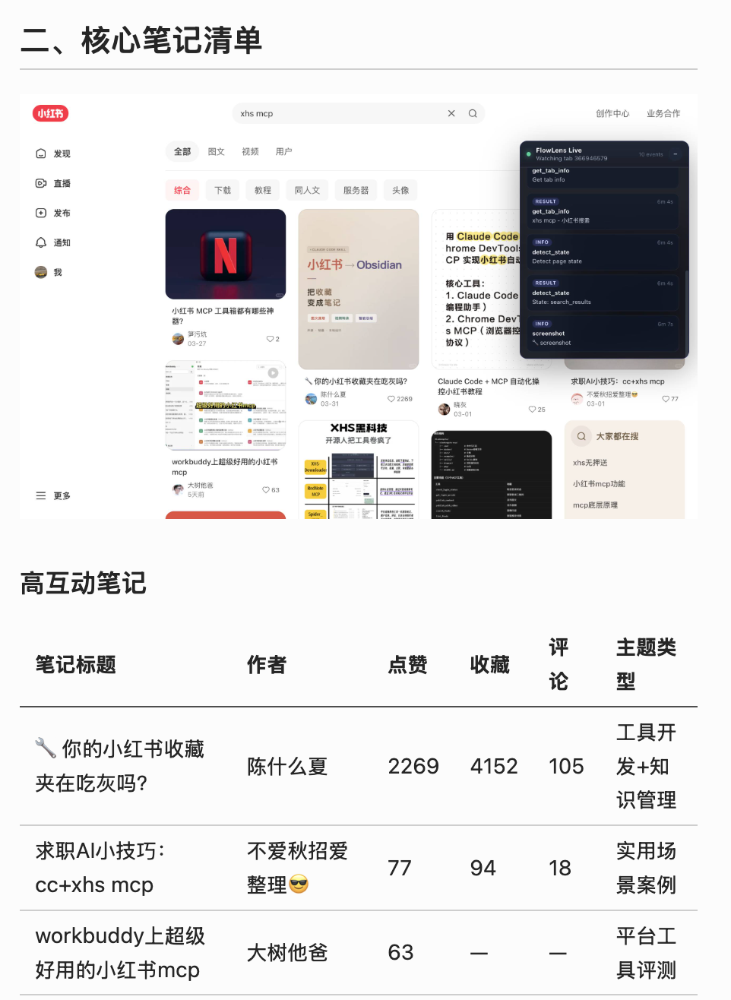
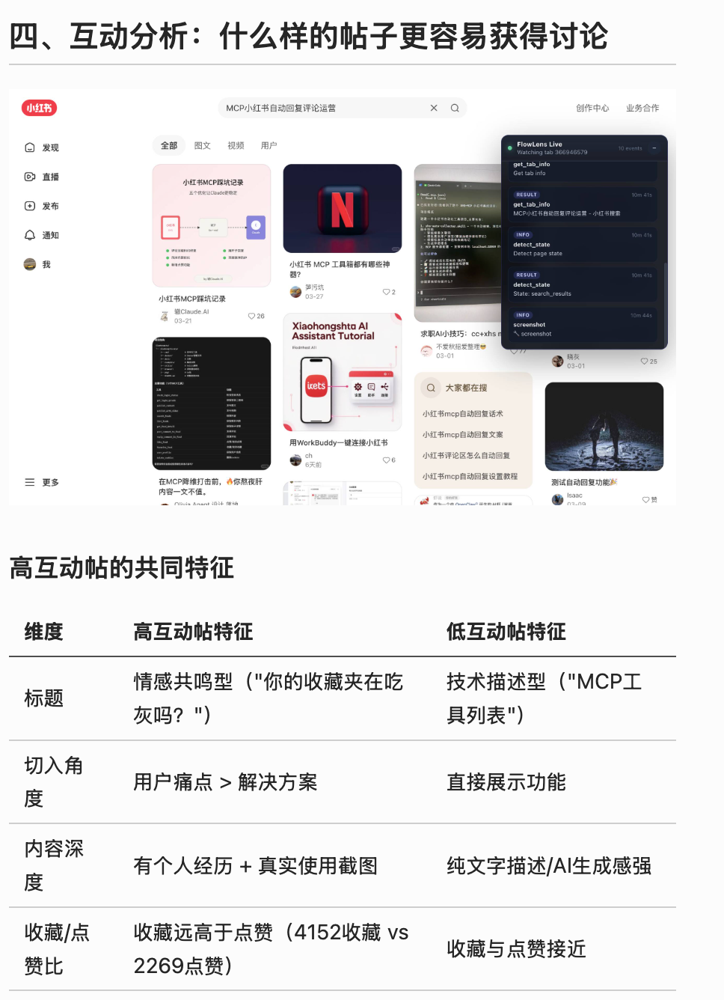
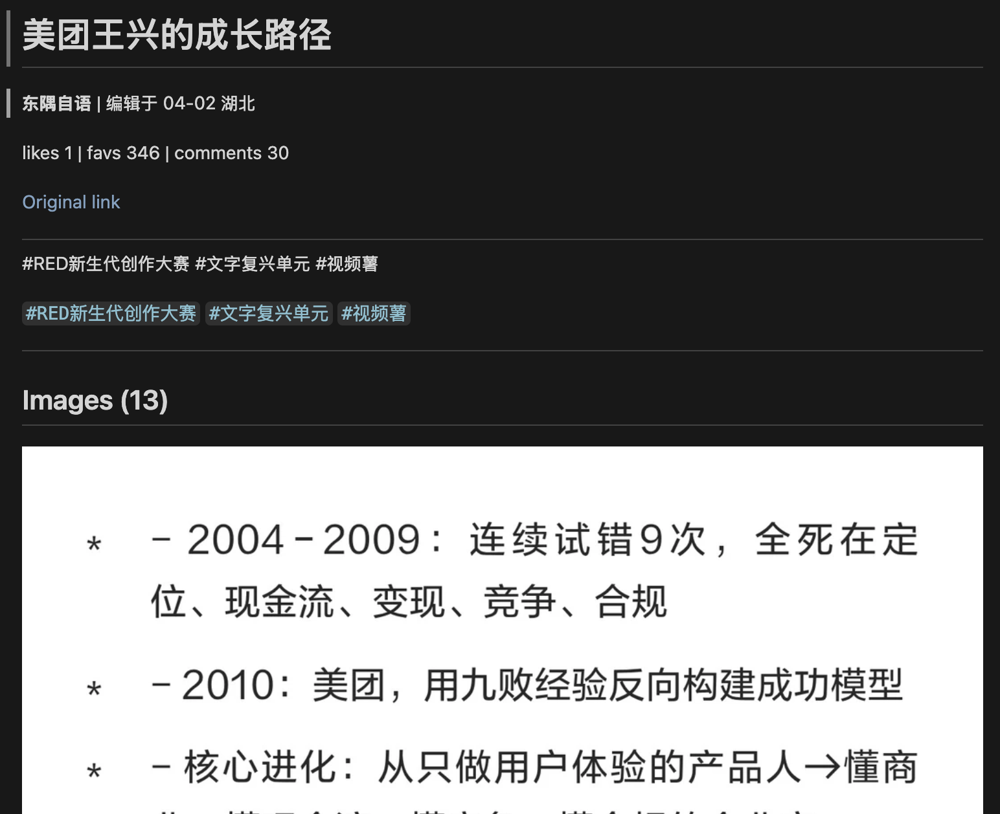
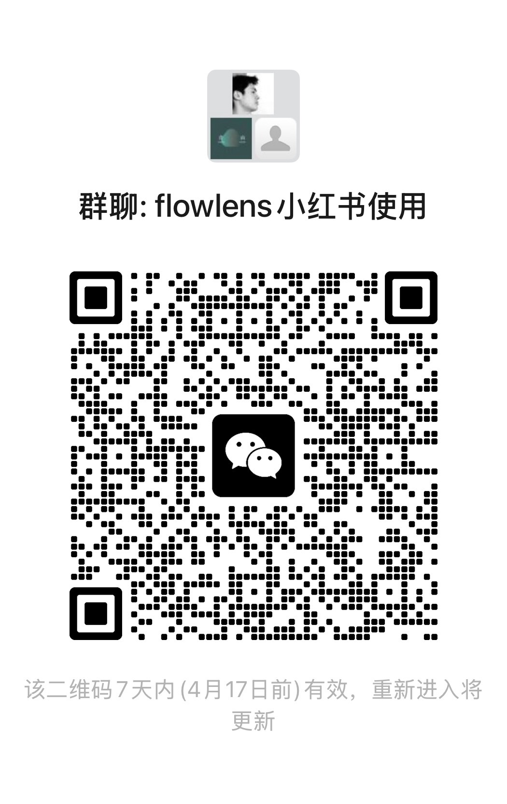

# FlowLens: Privacy-First Computer Use Agent with Local Visual Memory

FlowLens is a computer use and browser use framework with lightweight local multimodal models and observation-learning loop. These designs enable a fast, stable and privacy-first CUA compared to other frameworks. FlowLens comes with a Chrome extension and a thin desktop app. Currently there are task specific knowledge for Xiaohongshu research and WeChat use.

## 小红书助手

FlowLens 专门沉淀了小红书站点知识，并通过 Chrome 插件连接你当前登录态下的浏览器，执行小红书调研、内容抽取和自定义 agent 任务。

特点：
1. 不使用程序化的批量爬虫，而是像人一样逐个搜索和点击，尽可能不违反小红书规则和被屏蔽
2. 沉淀了小红书网站知识和操作，避免agent盲目识别探索，提高成功率
3. 复用已登录的chrome小红书账号，避免未登录被屏蔽

### 安装

```bash
git clone https://github.com/tonyc-ship/flowlens.git
cd flowlens
pip install -e .
```

### 配置LLM

运行交互式引导，按提示选择认证方式（Anthropic API Key、OpenAI API Key、或 OpenAI OAuth 登录）：

```bash
flowlens auth
```

只需配置任意一个 LLM 提供商即可。也可以直接写 `.env.local`：

```bash
ANTHROPIC_API_KEY=sk-ant-...
```

### 加载 Chrome Extension

1. 打开 `chrome://extensions/`
2. 打开右上角 **开发者模式**
3. 点击 **加载已解压的扩展程序**，选择本地`flowlens/chrome_extension/` 目录

Extension 会在运行命令时自动连接，不需要手动操作。如果遇到连接超时，确认 Chrome 已打开且 extension 已启用。

### 运行命令

```bash
# 话题调研 —— 搜索、阅读笔记、生成报告
flowlens xhs search "露营装备"

# 获取单篇笔记
flowlens xhs note "https://www.xiaohongshu.com/explore/..."

# 获取作者主页帖子
flowlens xhs author "https://www.xiaohongshu.com/user/profile/..."

# 自定义 agent 任务
flowlens xhs agent "找最近高互动的露营清单帖子并总结标题套路"
```

任务结果保存在 `task_runs/`，包含 `result.json`、`report.md`、截图和推理日志。

### 示例

  

### 交流群



## Computer Use Agent

- Python 3.11+
- Node.js + npm and Rust toolchain, only if you want the desktop app
- Anthropic API key, or you can use fully local LLMs

Inside your preferred Python environment (don't omit the last dot):

```bash
pip install -e .
```

Or with `uv`:

```bash
uv sync
```

Download Local Models:
```bash
modelscope download --model mlx-community/Qwen3.5-2B-6bit --local_dir ~/.flowlens/weights/Qwen3.5-2B-6bit
modelscope download --model mlx-community/Qwen3.5-9B-MLX-4bit --local_dir ~/.flowlens/weights/Qwen3.5-9B-MLX-4bit
```

## Desktop

Only needed if you want the Tauri desktop app:

```bash
# Install Node.js and Rust however you prefer
npm --version
cargo --version

cd desktop_app
npm install
PATH="$HOME/.cargo/bin:$PATH" npm run tauri dev
```

macOS permissions you will likely need on first run:

- `Screen Recording` for the Python interpreter / terminal app that launches FlowLens
- `Accessibility` if you later use desktop automation flows
- `Automation` if you want browser URL capture via Apple Events

## Configure Local Env

Create a local env file:

```bash
cp .env.example .env.local
```

Minimum config for the default hosted path:

```bash
ANTHROPIC_API_KEY=...
```

Optional keys:

```bash
FLOWLENS_LLM_BACKEND=sonnet
FLOWLENS_WHISPER_CLI=
FLOWLENS_WHISPER_MODELS_DIR=
FLOWLENS_OBSERVER_DIFF_THRESHOLD=0.30
FLOWLENS_OBSERVER_CAPTURE_ALL_DISPLAYS=1
FLOWLENS_OBSERVER_CAPTURE_BACKEND=screencapture
FLOWLENS_OBSERVER_VISION_ENABLED=1
FLOWLENS_OBSERVER_VISION_MODEL=Qwen3.5-2B-6bit
```

## Observer-Only Quickstart

If you want continuous desktop capture without the desktop app, this is the shortest path:

```bash
flowlens observer install-agent
flowlens observer status
```

If you change `FLOWLENS_OBSERVER_*` environment variables, run `install-agent`
again so the launchd plist picks up the new values.

Observer now defaults to `FLOWLENS_OBSERVER_CAPTURE_BACKEND=screencapture`
because it is materially more stable than in-process Quartz capture for
long-running multi-display sessions. Set it to `quartz` only if you need the
lower latency and are willing to trade off stability.

You can check observer data in:

- `observer_data/observer.db`
- `observer_data/screenshots/`
- `observer_data/logs/capture.log`
- `observer_data/logs/resource_monitor.jsonl`

Browser task run directories also accumulate per-screenshot resource snapshots in
`screenshot_resource_log.jsonl`.


## Load The Chrome Extension

1. Open `chrome://extensions/`
2. Enable `Developer mode`
3. Click `Load unpacked`
4. Select `chrome_extension/`

## Package Layout

Canonical Python packages are now:

- `flowlens.core`: bridge, runtime, recorder, reporting, DOM-first interaction + verification primitives
- `flowlens.observer`: background desktop observation, storage, summarization, and recall
- `flowlens.perception`: hosted/local vision, OCR, grounding, transcription, media preprocessing
- `flowlens.reasoning`: task understanding, planning, evaluation, reusable knowledge extraction
- `flowlens.agent`: LLM-driven agent loop, generic browser/vision tools, backend abstraction (Anthropic + local Qwen MLX)
- `flowlens.knowledge`: per-site YAML knowledge files loaded into the agent prompt
- `flowlens.platforms.wechat`: site-level desktop adapter
- `flowlens.workflows.wechat`: concrete WeChat workflow CLI

The legacy hardcoded XHS workflow (`flowlens.platforms.xhs` and `flowlens.workflows.xhs`) was removed when the generic agent loop landed; XHS tasks now run through `flowlens agent` with knowledge loaded from `flowlens/knowledge/sites/xiaohongshu.yaml`.

## Common Commands

Run a free-form browser task through the agent loop:

```bash
flowlens "在小红书上调研露营装备"
flowlens agent "在小红书上调研露营装备" --backend qwen-local
```

Reload the unpacked Chrome extension through the live bridge:

```bash
flowlens extension reload
```

Inspect the observer subsystem state:

```bash
flowlens observer status
```

This now includes aggregate timing stats and the latest capture-stage timings (`capture_image_ms`, `diff_ms`, `ocr_ms`, `visual_ms`, `total_ms`).

Capture the current desktop once into the observer database:

```bash
flowlens observer capture-once
```

Install the background observer agent:

```bash
flowlens observer install-agent
```

Generate a lightweight local journal without LLM calls:

```bash
flowlens observer journal --no-llm
```

Run the local-vs-cloud web-use benchmark (text, DOM, screenshot cases):

```bash
python3 scripts/benchmark_webuse_models.py
```

This writes a timestamped benchmark bundle under `task_runs/` with per-case outputs, timing, and simple quality scoring for `sonnet` vs `qwen-local`.
