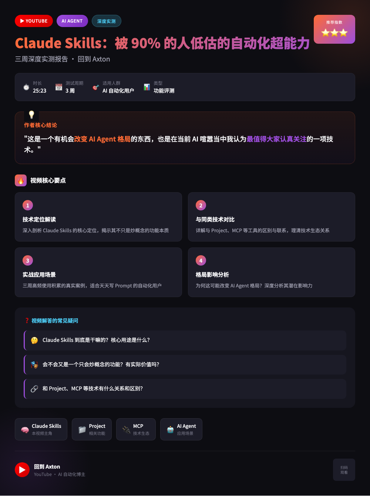
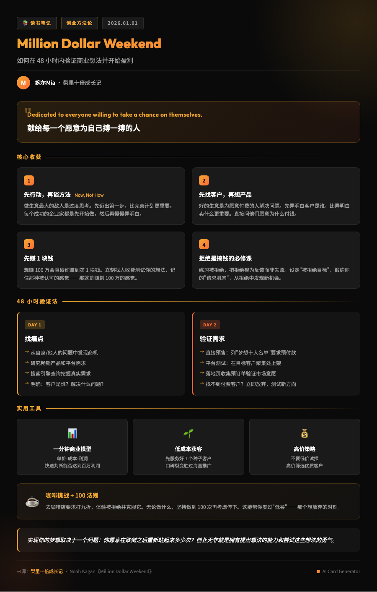

# 📸 Info Card Generator

**一键将文章、办公文档、笔记转换为精美信息卡片的 AI 工作流。**


---

## ✨ 功能特点

- 📄 **多来源支持**：网页链接、办公文档（Word/PPT/PDF）、Markdown 文件、纯文本
- 🎨 **风格多样**：赛博朋克、极简主义、蓝图设计、玻璃拟态等
- 📊 **高信息密度**：保留核心要点，避免过度精简
- 🤖 **AI 驱动**：配合 Claude/Gemini 等 AI 助手使用
- 📱 **一键导出**：自动生成 HTML + PNG 图片

---

## 🚀 快速开始

### 1. 环境要求

- **Node.js** 18.0 或更高版本
- **Python** 3.9 或更高版本
- **npm** 或 **yarn**
- 一个支持 Workflows 的 AI 代码助手（如 Claude Code, Cursor, Windsurf 等）

### 2. 安装依赖

```bash
# 克隆项目
git clone https://github.com/manwithshit/info-card-generator.git
cd info-card-generator

# 安装 Node 依赖
npm install

# 安装 Playwright 浏览器内核（用于截图）
npx playwright install chromium

# 安装 Python 依赖（用于文档解析）
pip install python-docx python-pptx pdfplumber
```

### 3. 使用方式

#### 方式 A：配合 AI 助手使用（推荐）

在项目目录下打开你的 AI 代码助手，输入：

```
/generate-card https://example.com/article
```

也可以直接丢一份文档：

```
/generate-card @报告.docx
```

或者用自然语言：

```
帮我把这篇文章做成信息卡片：https://example.com/article
```

AI 会自动：
1. 读取/解析内容（网页、文档或纯文本）
2. 提炼核心要点
3. 生成精美 HTML 卡片
4. 截图保存为 PNG

#### 方式 B：手动截图

如果你已经有 HTML 卡片文件，可以直接运行截图脚本：

```bash
node scripts/capture_card.js path/to/card.html
```

输出的 PNG 会保存在同目录下。

---

## 📂 项目结构

```
info-card-generator/
├── input/                      # 原始内容（Markdown 格式）
├── output/
│   └── cards/                  # 生成的卡片（HTML + PNG）
│       └── [card_name]/
│           ├── [card_name].html
│           └── [card_name].png
├── scripts/
│   ├── capture_card.js         # Playwright 截图脚本
│   ├── extract_document.py     # 办公文档解析（docx/pptx/pdf → Markdown）
│   └── html_to_pdf.js          # HTML 转 PDF 脚本（可选）
├── templates/
│   └── basic_card.html         # 基础卡片模板
├── examples/                   # 示例卡片
├── skills/
│   └── info-card-design/
│       └── SKILL.md            # AI Skill 定义（自动触发）
├── .agent/
│   └── workflows/
│       └── generate-card.md    # AI 工作流定义（显式触发）
├── package.json
└── README.md
```

---

## 🎨 卡片风格示例

| 风格 | 示例 |
|------|------|
| **Deep Tech / Analysis** |  |
| **Growth Hacker / Notes** |  |

| 风格 | 适用场景 |
|------|----------|
| **Cyberpunk / Terminal** | 技术教程、编程指南 |
| **Blueprint** | 系统架构、技术规范 |
| **Editorial / Financial** | 商业分析、市场报告 |
| **Glassmorphism** | 现代应用、生活方式 |
| **Retro / Typewriter** | 知识管理、读书笔记 |
| **Material Design 3** | Google 相关、产品发布 |
| **Growth Hacker** | 创业案例、增长分析 |

---

## ⚙️ 配置说明

### 截图脚本配置

`scripts/capture_card.js` 默认会查找以下 CSS 选择器作为卡片容器：

```javascript
['.card-container', '.card', '.info-card', '[data-card]', 'main', 'article', 'body']
```

如果你的卡片使用了自定义类名，可以修改脚本中的 `cardSelectors` 数组。

### 工作流配置

`.agent/workflows/generate-card.md` 定义了 AI 的工作流程。你可以根据需要修改：

- 内容获取优先级
- 卡片设计规范
- 输出目录结构

---

## 🔧 常见问题

### Q: 截图脚本报错 "chromium not found"

运行以下命令安装浏览器内核：

```bash
npx playwright install chromium
```

### Q: 网页内容抓取失败

某些网站有反爬机制（如微信公众号）。工作流会自动尝试：
1. 直接抓取 → 2. 浏览器模拟 → 3. NotebookLM（需手动）

### Q: 如何自定义卡片样式？

1. 复制 `templates/basic_card.html` 作为起点
2. 修改 CSS 样式
3. 在生成时指定使用你的模板

---

## 📜 开源协议

MIT License - 详见 [LICENSE](LICENSE)

---

## 🙏 致谢

- [Playwright](https://playwright.dev/) - 浏览器自动化
- [Anthropic Claude](https://www.anthropic.com/) / [Google Gemini](https://gemini.google.com/) - AI 驱动

---

**Made with ❤️ for knowledge workers.**
